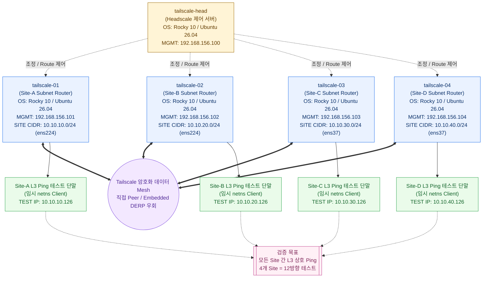

# Headscale + Tailscale Site-to-Site VPN with Ansible

<!-- README.md와 README.ko.md의 구조와 의미를 항상 동일하게 유지한다. -->

내부 CA 기반 Headscale 제어 서버와 Tailscale subnet router를 배포하여
온프레미스 Site-to-Site L3 VPN을 구성하는 Ansible Role 기반 IaC 프로젝트다.
Embedded DERP, subnet route 승인, IP forwarding 및 MSS Clamping까지 자동화하며,
각 Site의 테스트 단말과 NetworkManager NIC 연결 프로파일은 관리 대상에 포함하지
않는다.

## 검증 환경 및 요구사항

현재 구성과 테스트에 사용한 기준 환경은 다음과 같다.

| 구분 | 검증 환경 |
|---|---|
| Ansible 제어 노드 | Ansible Core 2.17.4 |
| 제어 노드 Python | Python 3.12.12 |
| 관리 대상 OS | Rocky Linux 10, Ubuntu 26.04 LTS amd64 |
| Headscale | 0.29.1 standalone binary |
| Tailscale | 배포판별 Tailscale stable repository 패키지 |

Ansible Core 2.17.4 이상 사용을 권장한다. 더 낮은 버전에서는 사용 중인 module,
Jinja filter 및 task 동작의 호환성을 보장하지 않는다.

Rocky Linux 10과 Ubuntu 26.04 LTS amd64에서 초기 OS 대상 전체 설치, Headscale
등록, subnet route 승인 및 Site-to-Site 통신을 실제 검증했다. Role은 Ansible
Facts로 OS를 자동 판별하여 패키지명, Chrony 설정과 서비스, CA trust 및 Tailscale
저장소를 선택하므로 지원 OS를 vars에서 따로 지정할 필요가 없다. 현재 명시적 지원
대상이 아닌 배포판과 버전은 설치 초기에 중단한다.

## 검증된 4개 Site 토폴로지

다음 그림은 현재 `inventory.ini`의 검증 환경을 반영한다. 점선은 Headscale 제어
연결이고, 굵은 선은 논리적인 Tailscale 암호화 데이터 Mesh를 나타낸다. 데이터
트래픽은 가능하면 Router 간 Peer-to-Peer로 직접 전송되고, 직접 연결할 수 없으면
Embedded DERP를 경유한다. Headscale는 Tailnet을 조정하지만 필수 중앙 데이터 경로
게이트웨이는 아니다.

<!-- 이 검증 토폴로지를 inventory.ini와 항상 동일하게 유지한다. -->



제어 노드에는 다음 명령이 필요하다.

- `ansible-playbook`
- `ssh`
- `ssh-copy-id` — SSH Bootstrap을 사용할 때

관리 대상 노드는 초기 NIC/IP 구성이 끝나 있고 SSH 접속이 가능해야 한다.

## 파일 구조

- `vars-common.yaml`: 모든 노드에 공통인 버전, 경로, 인증서 DN, 포트 및 동작 변수
- `vars/os`: OS 계열별 패키지, 서비스, CA trust 및 Tailscale 저장소 변수
- `inventory.ini`: Ansible 접속 대상과 관리 IP
- `roles/ssh_bootstrap`: 선택적 `ssh-copy-id` 기반 SSH 키 초기 배포
- `roles/os_compat`: 지원 OS/아키텍처 검증 및 OS별 변수 로드
- `roles/common`: 공통 OS, 시간 동기화, hosts, 패키지, 선택적 firewalld
- `roles/headscale`: CA/TLS, Headscale binary/config/policy/systemd/user
- `roles/tailscale_router`: CA trust, Tailscale, forwarding, MSS Clamping, 노드 등록
- `roles/site_test_endpoint`: 선택적 netns 가상 단말 생성 및 Site 간 ping 검증
- `pb-tailscale-with-headscale.yaml`: 전체 실행 순서와 subnet route 승인
- `run.sh`: 플레이북 실행 진입점

## 실행 전 준비

제어 노드에서 세 노드에 SSH 접속 및 `become`이 가능해야 한다. 현재 inventory의
기본값은 `root` 접속이다. 다른 계정이나 SSH 키를 쓰면 `inventory.ini`의
`ansible_user`, `ansible_port` 및 필요한 접속 변수를 조정한다.
Ubuntu 설치 이미지처럼 root SSH 로그인을 기본 허용하지 않는 환경에서는 각 호스트에
`ansible_user=ubuntu`를 지정하고, sudo 암호가 필요하면 실행 시 `--ask-become-pass`를
전달한다. 호스트 변수는 `[tailscale:vars]`의 `ansible_user=root`보다 우선한다.

Passwordless SSH가 준비되지 않은 환경에서는 `vars-common.yaml`에서 다음 값을
설정한다. 개인키와 같은 이름의 `.pub` 공개키가 있어야 하며, 비밀번호는 파일에
저장하지 않고 `ssh-copy-id`가 실행 중 터미널에서 직접 요청한다.

```yaml
ssh_copy_id_enabled: true
ssh_copy_id_identity_file: /root/.ssh/id_rsa
ssh_copy_id_public_key_file: "{{ ssh_copy_id_identity_file }}.pub"
```

첫 Play는 모든 inventory 호스트에 `ssh-copy-id`를 실행한다. 원격
`authorized_keys`에 동일한 공개키가 이미 있으면 `ssh-copy-id` 자체 검사로 중복
추가하지 않으며, 지정 키가 바뀌었거나 없을 때만 비밀번호 인증 후 추가한다. 초기
키 배포가 끝난 뒤에는 다음 실행부터 `ssh_copy_id_enabled: false`로 되돌려도 된다.

실제 환경에 맞게 `inventory.ini`를 수정한다. 호스트명은 inventory의 호스트 이름으로,
관리 IP는 `ansible_host`로 지정한다. `host_alias`, `site_nic`, `site_cidr`, 인증서
SAN처럼 호스트마다 다른 값도 해당 호스트 행에 지정한다.

```ini
[headscale]
my-head.example.com ansible_host=192.168.156.100 host_alias=head cert_dns_sans='["my-head.example.com", "head"]' cert_ip_sans='["192.168.156.100"]'

[tailscale_routers]
site-a.example.com ansible_host=192.168.156.101 host_alias=site-a site_nic=ens224 site_cidr=10.10.10.0/24
site-b.example.com ansible_host=192.168.156.102 host_alias=site-b site_nic=ens224 site_cidr=10.10.20.0/24

[site_test_endpoints]
site-a.example.com site_test_ip=10.10.10.201
site-b.example.com site_test_ip=10.10.20.202
```

NIC 주소 자체는 이미 구성된 상태를 전제로 하며 이 플레이북이 NetworkManager
연결 프로파일을 변경하지 않는다. `site_nic`은 각 Site LAN NIC 이름,
`site_cidr`은 해당 라우터가 광고할 LAN 대역이다.

Firewalld와 SELinux 관련 설정은 기본적으로 적용하지 않는다. 두 옵션은 Rocky Linux
등 RedHat 계열 전용이며, 대상 환경에서 해당 기능을 사용할 때만
`vars-common.yaml`에서 활성화한다. Ubuntu에서 활성화하면 잘못된 방화벽 구성을
방지하기 위해 설치 초기에 중단한다. Ubuntu의 AppArmor 상태는 변경하지 않는다.

```yaml
common_manage_firewalld: true
common_manage_selinux: true
```

`common_manage_firewalld: false`이면 firewalld 패키지 설치, 서비스 시작, 포트 및
zone 변경을 모두 건너뛴다. 기존 firewalld를 중지하거나 제거하지는 않는다.
`common_manage_selinux: false`이면 Headscale 파일의 SELinux context 복원을
건너뛰며, SELinux 자체의 enforcing/permissive/disabled 상태는 변경하지 않는다.

Site-to-Site TCP의 터널 MTU 문제를 예방하기 위한 MSS Clamping은 Firewalld와
독립적으로 기본 적용한다.

```yaml
tailscale_manage_mss_clamping: true
tailscale_interface: tailscale0
```

라우터의 mangle/FORWARD 체인에 `tailscale0` 출력 및 입력 방향 TCP SYN 규칙을
각각 하나씩 유지하며, `tailscale-mss-clamping.service`로 재부팅 후에도 적용한다.
특수한 환경에서 외부 방화벽 관리 도구가 같은 규칙을 전담할 때만
`tailscale_manage_mss_clamping: false`로 비활성화한다.

## Site-to-Site 패킷 흐름

Site-A 단말이 Site-B 단말로 통신할 때의 직접 연결 기준 경로는 다음과 같다.

```text
Site-A Client 10.10.10.10
Gateway 10.10.10.101
        │ ① Site-A Router가 패킷을 수신하고
        │    10.10.20.0/24의 경로를 tailscale0으로 결정
        ▼
Site-A Router ens224 → tailscale0
        │ ② tailscaled가 Site-B Router를 Peer로 선택하고
        │    원본 패킷을 암호화·UDP 캡슐화
        ▼
Site-A Router ens160  192.168.156.101
        │ ③ Underlay 직접 전송
        │    192.168.156.101 → 192.168.156.102
        ▼
Site-B Router ens160  192.168.156.102
        │ ④ Peer 검증 후 복호화하여 tailscale0에 주입
        │    Linux가 10.10.20.0/24의 경로를 ens224로 결정
        ▼
Site-B Router tailscale0 → ens224
        │ ⑤ Site-B LAN으로 원본 패킷 전달
        ▼
Site-B Client 10.10.20.10
```

`--snat-subnet-routes=false` 설정으로 Site-B 단말에는 원본 출발지
`10.10.10.10`이 유지된다. 따라서 양쪽 단말은 각 Site Router를 기본 게이트웨이로
사용하거나 반대편 Site CIDR에 대한 정적 경로를 가져야 한다. Router 간 직접 UDP
연결이 불가능하면 암호화된 트래픽은 Headscale의 Embedded DERP를 경유한다.

## 실행

```bash
./run.sh
```

SSH 키를 지정하는 등 일반 `ansible-playbook` 옵션을 그대로 전달할 수 있다.

```bash
./run.sh --private-key ~/.ssh/id_ed25519
./run.sh --limit tailscale-head
./run.sh --check --diff
```

`--check`는 template, package 등 일반 Ansible module의 예상 변경 확인에는 유용하지만,
Pre-auth key 생성, `tailscale up`, route 승인 및 `ssh-copy-id` 같은 command 기반
작업의 전체 실행 결과를 재현하지는 않는다. SSH Bootstrap을 사용하지 않는 check
mode 실행에서는 `ssh_copy_id_enabled=false`를 함께 지정하는 것을 권장한다.

```bash
./run.sh --check --diff -e ssh_copy_id_enabled=false
```

Role 또는 단계별 단독 실행은 태그를 사용한다.

```bash
./run.sh --tags ssh_bootstrap
./run.sh --tags common
./run.sh --tags headscale
./run.sh --tags tailscale_router
./run.sh --tags route_approval
./run.sh --tags site_test_endpoint -e tailscale_site_test_enabled=true
```

비활성화된 SSH Bootstrap을 일회성으로 실행하려면 vars 파일을 수정하지 않고도
추가 변수로 활성화할 수 있다.

```bash
./run.sh --tags ssh_bootstrap -e ssh_copy_id_enabled=true
```

호스트까지 제한하려면 `--limit`을 함께 사용한다.

```bash
./run.sh --tags tailscale_router --limit tailscale-01 -vv
```

태그와 실행 task 목록은 다음 명령으로 확인할 수 있다.

```bash
./run.sh --list-tags
./run.sh --tags headscale --list-tasks
```

최초 전체 구성에서는 `--limit`을 사용하지 않는다. Headscale 구성, 라우터 등록,
광고 route 승인 순서가 필요하기 때문이다.

## 선택적 netns 가상 단말 검증

실제 Site 단말 없이도 각 Router에 임시 Linux network namespace와 veth를 생성하여
Site-to-Site 데이터 경로를 검증할 수 있다. 검증할 Router만 선택적
`[site_test_endpoints]` 그룹에 추가하고 `site_test_ip`를 호스트별로 지정한다.

```ini
[site_test_endpoints]
tailscale-01 site_test_ip=10.10.10.201
tailscale-02 site_test_ip=10.10.20.202
```

테스트가 필요 없거나 테스트 IP를 배정할 수 없는 환경에서는 그룹을 비워두거나
제거하면 된다. `[tailscale_routers]`의 설치 및 운영에는 영향을 주지 않는다.

전체 설치와 route 승인이 끝난 후 실행한다.

```bash
./run.sh --tags site_test_endpoint -e tailscale_site_test_enabled=true
```

Role은 각 Router에 netns를 생성하고 자신을 제외한 모든 Site endpoint로 ping을
자동 검증한다. 기본값은 테스트 환경을 만들지 않는 `false`이며, 검증 후 자동
삭제하려면 다음 옵션을 추가한다.

```bash
./run.sh --tags site_test_endpoint \
  -e tailscale_site_test_enabled=true \
  -e tailscale_site_test_cleanup_after_validation=true
```

남겨둔 테스트 환경은 각 Router에서 다음처럼 수동 확인·삭제할 수 있다.

```bash
ip netns exec ns-test ping -c 4 <반대편-site_test_ip>
ip netns exec ns-test traceroute <반대편-site_test_ip>
/usr/local/sbin/tailscale-site-test-endpoint cleanup
```

## 재실행과 변수 변경

플레이북은 반복 실행을 전제로 한다. 이미 등록된 Tailscale 노드는 새 Pre-auth key를
만들지 않고 `tailscale up`으로 원하는 설정을 재조정한다. 미등록 노드에만 Headscale가
일회용 키를 생성하며 Ansible 출력에는 키를 숨긴다.

- 설정/policy/systemd/TLS 배치 변경: Headscale 재시작
- CA 변경: CA와 서버 인증서 재발급, trust store 갱신, 관련 서비스 재시작
- 서버 SAN/IP 변경: 서버 인증서 재발급
- forwarding 변경: `sysctl --system` 적용
- site CIDR 변경: router 광고 설정 재적용 후 Headscale에서 승인
- site NIC 변경: 새 NIC를 firewalld trusted zone에 추가
- MSS Clamping 변경: systemd oneshot 서비스로 중복 없이 재적용

기존 NIC를 trusted zone에서 자동 제거하지는 않는다. 한 노드에 trusted NIC가 여러
개일 수 있고, Ansible이 소유하지 않은 방화벽 설정을 임의 삭제하면 장애가 날 수 있기
때문이다. 교체 후 기존 NIC를 제거해야 한다면 명시적으로 실행한다.

```bash
firewall-cmd --permanent --zone=trusted --remove-interface=<기존-NIC>
firewall-cmd --reload
```

CA DN을 변경하면 새 루트 CA가 발급되므로 이미 등록된 모든 클라이언트에 전체
플레이북을 적용해야 한다. `headscale_data_dir`을 변경할 때 기존 DB/키의 자동 이전은
데이터 손실 방지를 위해 수행하지 않는다. 기존 상태를 유지해야 한다면 실행 전에
DB와 noise/DERP key를 새 경로로 계획적으로 이관한다.

## 확인

```bash
ansible tailscale -b -m command -a 'systemctl is-active firewalld'
ansible headscale -b -m command -a 'headscale nodes list-routes'
ansible tailscale_routers -b -m command -a 'tailscale status'
ansible tailscale_routers -b -m command -a 'sysctl net.ipv4.ip_forward'
ansible tailscale_routers -b -m command -a 'systemctl is-active tailscale-mss-clamping'
ansible tailscale_routers -b -m command -a 'iptables -t mangle -S FORWARD'
```

최종 데이터 경로는 각 Site 테스트 단말에서 상대편 단말로 `ping`, `traceroute`를
수행하고 각 subnet router의 site NIC와 `tailscale0`에서 `tcpdump`하여 검증한다.

## Headscale 관리·운용 명령

다음 예시는 Headscale 서버에서 `root`로 실행하는 것을 기준으로 한다. Headscale
CLI 자체는 root가 필수는 아니며, Headscale Unix socket과 관련 설정 파일에 접근할
수 있는 사용자도 실행할 수 있다. systemd 서비스 제어와 일부 로그 조회에는 root
또는 sudo 권한이 필요할 수 있다. 현재 설치 버전의 정확한 하위 명령과 옵션은
`headscale <명령> --help`로 확인한다.

### 상태 및 구성 확인

```bash
headscale version
headscale health
runuser -u headscale -- \
  /usr/local/bin/headscale configtest --config /etc/headscale/config.yaml
systemctl status headscale --no-pager
journalctl -u headscale -n 100 --no-pager
```

- `version`: 실행 중인 CLI 버전을 확인한다.
- `health`: Headscale API 상태를 확인하며, 정상일 때 출력 없이 종료 코드 `0`을
  반환할 수 있다.
- `configtest`: 서비스 계정 권한으로 실행하여 재시작 전에 `config.yaml`의 유효성을
  검사한다. 생성 파일의 소유자가 `root`로 바뀌는 것을 방지하기 위해 서비스 계정으로
  실행한다.
- `systemctl`, `journalctl`: 기동 실패나 Unix socket 연결 실패 원인을 확인한다.

### 사용자와 노드 조회

```bash
headscale users list
headscale nodes list
headscale nodes list --output json
```

- `users list`: 사용자 이름과 ID를 확인한다. Pre-auth key 생성에는 사용자 ID가
  필요하다.
- `nodes list`: 등록 노드의 ID, 소유 사용자, Tailnet IP, 접속 및 만료 상태를
  확인한다.
- `--output json`: 스크립트나 `jq`를 이용한 자동 처리에 적합하다.

```bash
headscale nodes list --output json | jq '.[] | {id, name, user, online}'
```

### Subnet route 확인 및 승인

```bash
headscale nodes list-routes
headscale nodes approve-routes \
  --identifier <NODE_ID> \
  --routes 10.10.10.0/24
```

`list-routes`에서 `Available`은 Router가 광고한 경로, `Approved`는 관리자가 승인한
경로, `Serving`은 현재 실제 제공 중인 경로다. 이 프로젝트는 전체 Play 실행 시
inventory의 `site_cidr`을 자동 승인하므로 수동 승인은 장애 확인이나 긴급 운용 시에만
사용한다.

### Pre-auth key 확인 및 수동 발급

```bash
headscale preauthkeys list
headscale preauthkeys create --user <USER_ID>
```

기본 Pre-auth key는 일회용이며 제한된 유효기간을 가진다. 발급 결과는 신규 노드의
`tailscale up --authkey`에 사용되므로 비밀번호와 동일한 민감정보로 취급하고 로그,
쉘 스크립트 및 Git 저장소에 기록하지 않는다. Ansible은 미등록 Router에 대해서만
키를 자동 발급하고 결과를 출력에서 숨긴다.

### 명령 도움말

```bash
headscale --help
headscale users --help
headscale nodes --help
headscale preauthkeys --help
```

Headscale 버전을 변경하면 CLI 옵션이 달라질 수 있으므로 destructive operation이나
자동화 코드를 실행하기 전에 해당 설치 버전의 `--help`를 우선 확인한다.

## Tailscale Router 관리·운용 명령

다음 명령은 각 Site의 Tailscale Router에서 실행한다. 대부분의 조회 명령은
`tailscaled`의 local API에 접근할 수 있는 사용자라면 실행 가능하지만, 서비스 제어와
Linux 라우팅·방화벽 조회에는 root 또는 sudo 권한이 필요할 수 있다.

### 버전, 연결 및 주소 확인

```bash
tailscale version
tailscale status
tailscale status --json
tailscale ip -4
tailscale ip -6
systemctl status tailscaled --no-pager
```

- `status`: 자신의 Tailnet 상태와 Peer의 Tailnet IP, 접속 여부 및 현재 통신 경로를
  확인한다.
- `status --json`: 모니터링이나 `jq` 기반 자동 점검에 사용한다.
- `ip`: 현재 Router에 할당된 Tailscale IPv4 또는 IPv6 주소를 확인한다.
- `systemctl`: `tailscaled` 프로세스의 실행 및 장애 상태를 확인한다.

```bash
tailscale status --json | jq '{BackendState, Self, Peer}'
```

### Peer 경로와 Underlay 상태 확인

```bash
tailscale ping --c 4 <PEER_NAME_OR_100.X_IP>
tailscale netcheck
journalctl -u tailscaled -n 100 --no-pager
tailscale debug daemon-logs
```

- `tailscale ping`: 일반 ICMP ping보다 Tailnet 경로 진단에 적합하며, Peer까지 직접
  연결됐는지 또는 DERP를 경유했는지 출력한다.
- `netcheck`: 현재 Underlay의 UDP 사용 가능 여부, NAT 특성 및 DERP 지연시간을
  확인한다.
- `journalctl`: 과거의 daemon 로그를 확인한다.
- `debug daemon-logs`: 현재 발생하는 daemon 로그를 실시간으로 확인하며 종료하려면
  `Ctrl+C`를 누른다.

### Subnet Router 설정과 Linux 전달 경로 확인

```bash
tailscale debug prefs
ip route show table 52
sysctl net.ipv4.ip_forward
iptables -t mangle -S FORWARD
systemctl status tailscale-mss-clamping --no-pager
```

- `debug prefs`: Headscale URL, 광고 route, route 수신 및 SNAT 등 현재 local
  preference를 확인할 때 유용하다. debug 하위 명령은 Tailscale 버전에 따라 변경될 수
  있으므로 먼저 `tailscale debug --help`를 확인한다.
- `ip route show table 52`: Linux에서 Tailscale이 설치한 remote Site route를
  확인한다.
- `ip_forward`: Site 간 L3 forwarding 활성화 여부를 확인한다.
- `iptables`, `tailscale-mss-clamping`: VPN 캡슐화에 대비한 MSS Clamping 규칙과
  영속화 서비스 상태를 확인한다.

### Peer 통신과 Site-to-Site 통신 구분

```bash
# Tailscale Router Peer 자체의 Tailnet 연결 확인
tailscale ping --c 4 tailscale-02

# 상대 Site LAN 또는 단말까지의 전체 L3 경로 확인
ping -c 4 10.10.20.126
traceroute 10.10.20.126
```

`tailscale ping` 성공은 Router Peer 사이의 Tailnet 연결을 의미한다. 실제 Site-to-Site
VPN 검증에는 상대 Site의 `site_cidr`에 속한 Router NIC 또는 단말 IP로 일반 `ping`,
`traceroute`를 실행해야 한다.

### 설정 변경 시 주의사항

```bash
tailscale set --help
tailscale up --help
tailscale logout --help
```

이 프로젝트는 `tailscale up` 설정을 Ansible로 관리한다. 수동 `tailscale set` 또는
`tailscale up` 변경은 다음 Playbook 실행에서 inventory와 `vars-common.yaml` 값으로
되돌아갈 수 있다. 특히 `tailscale logout`은 현재 등록을 해제하고 재인증을 요구하므로
장애 복구나 노드 폐기 목적이 아니면 실행하지 않는다.
