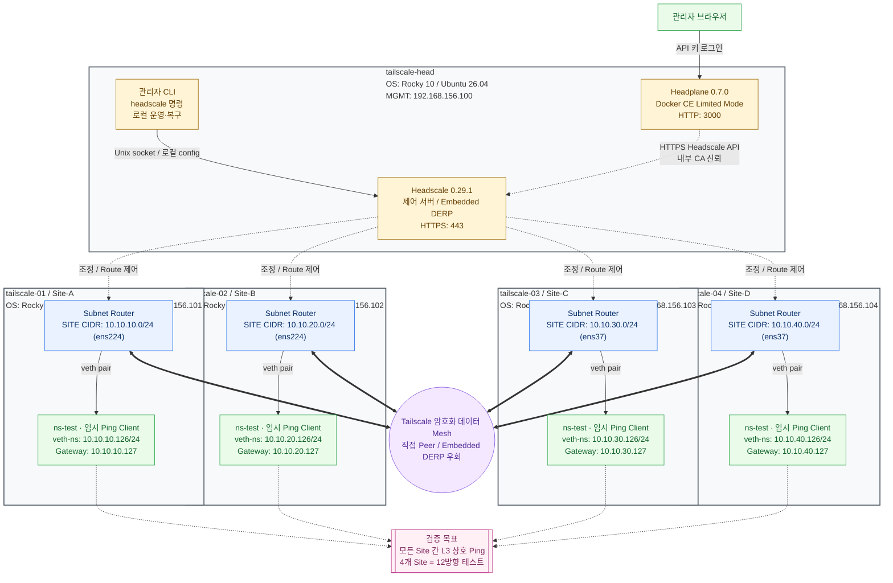

# Headscale + Tailscale Site-to-Site VPN with Ansible

<!-- README.md와 README.ko.md의 구조와 의미를 항상 동일하게 유지한다. -->

내부 CA 기반 Headscale 제어 서버와 Tailscale subnet router를 배포하여
온프레미스 Site-to-Site L3 VPN을 구성하는 Ansible Role 기반 IaC 프로젝트다.
Embedded DERP, subnet route 승인, IP forwarding 및 MSS Clamping까지 자동화하며,
각 Site의 테스트 단말과 NetworkManager NIC 연결 프로파일은 관리 대상에 포함하지
않는다.

Tailscale과 Headscale의 용도는 Site-to-Site VPN에 한정되지 않는다. 기본 장치 VPN은
PC, 서버 또는 모바일 장치마다 Tailscale을 설치하고 Headscale에 등록하는 것만으로
subnet route 광고나 subnet router 없이 Tailnet IP를 통해 장치 간 직접 통신할 수
있다. 이 프로젝트는 여기에 추가되는 Site-to-Site L3 routing 구성을 자동화하는 데
초점을 두며, 일반 장치도 동일한 Tailnet에 등록하여 함께 사용할 수 있다.

## 검증 환경 및 요구사항

현재 구성과 테스트에 사용한 기준 환경은 다음과 같다.

| 구분 | 검증 환경 |
|---|---|
| Ansible 제어 노드 | Ansible Core 2.17.4 |
| 제어 노드 Python | Python 3.12.12 |
| 관리 대상 OS | Rocky Linux 10, Ubuntu 26.04 LTS amd64 |
| Headscale | 0.29.1 standalone binary |
| Tailscale | 배포판별 Tailscale stable repository 패키지 |

Ansible Core 2.17.4 이상 사용을 권장한다. 더 낮은 버전에서는 사용 중인 module,
Jinja filter 및 task 동작의 호환성을 보장하지 않는다.

Rocky Linux 10과 Ubuntu 26.04 LTS amd64에서 초기 OS 대상 전체 설치, Headscale
등록, subnet route 승인 및 Site-to-Site 통신을 실제 검증했다. Role은 Ansible
Facts로 OS를 자동 판별하여 패키지명, Chrony 설정과 서비스, CA trust 및 Tailscale
저장소를 선택하므로 지원 OS를 vars에서 따로 지정할 필요가 없다. 모든 노드를 하나의
OS로 통일할 필요도 없으며, 동일 inventory 안에 Rocky Linux 10과 Ubuntu 26.04 노드가
혼재해도 각 노드에 맞는 설정을 자동 적용하여 함께 배포·운영할 수 있다. 현재 명시적
지원 대상이 아닌 배포판과 버전은 설치 초기에 중단한다.

## 검증된 4개 Site 토폴로지

다음 그림은 현재 `inventory.ini`의 검증 환경을 반영한다. 점선은 Headscale 제어
연결이고, 굵은 선은 논리적인 Tailscale 암호화 데이터 Mesh를 나타낸다. 데이터
트래픽은 가능하면 Router 간 Peer-to-Peer로 직접 전송되고, 직접 연결할 수 없으면
Embedded DERP를 경유한다. Headscale는 Tailnet을 조정하지만 필수 중앙 데이터 경로
게이트웨이는 아니다.

<!-- 이 검증 토폴로지를 inventory.ini와 항상 동일하게 유지한다. -->



제어 노드에는 다음 명령이 필요하다.

- `ansible-playbook`
- `ssh`

관리 대상 노드는 초기 NIC/IP 구성이 끝나 있고 SSH 접속이 가능해야 한다.

## 파일 구조

| 파일/Role | 역할 |
|---|---|
| `pb-tailscale-with-headscale.yaml` | Host scope, privilege, 실행 순서와 조건을 정의하고 Role을 호출하는 최상위 Playbook |
| `run.sh` | Vault password 파일을 선택하고 사용자 인자를 Playbook에 전달하는 실행 진입점 |
| `ansible.cfg` | Inventory, forks, SSH host-key 확인 등 Ansible 실행 기본값 |
| `inventory.ini` | Headscale/Router 그룹, 관리 IP, SSH 계정, Site NIC/CIDR와 netns 시험 주소 |
| `vars-common.yaml` | 버전, 경로, 포트와 공통 동작 변수 |
| `vars-OS-RedHat.yaml`, `vars-OS-Debian.yaml` | OS별 package, service, CA trust와 Tailscale repository 변수 |
| `vars-vault.yaml` | SSH Bootstrap 및 선택적 sudo 비밀번호 Vault 파일; 사용자가 생성하며 Git에서 제외 |
| `VARIABLES.ko.md`, `VARIABLES.md` | 모든 vars 파일의 변수별 상세 참조 |
| `roles/ssh_bootstrap` | Controller 입력 검증, Vault 비밀번호 기반 병렬 SSH 키 배포, 전체 결과 gate |
| `roles/os_compat` | 지원 OS/아키텍처 검증 및 OS별 변수 로드 |
| `roles/common` | Hostname, 시간 동기화, hosts, 공통 package와 선택적 firewalld 설정 |
| `roles/headscale` | 내부 CA/TLS, Headscale binary, config, policy seed, systemd와 사용자 구성 |
| `roles/headplane` | Docker CE와 Headplane 관리 UI를 Limited Mode로 선택 배포 |
| `roles/tailscale_router` | CA trust, Tailscale 설치·등록, forwarding과 MSS Clamping 구성 |
| `roles/router_mgmt` | 등록 Router 검증, DB policy tagOwner 병합·JSON 정규화, node tag와 subnet route 승인 |
| `roles/site_test_endpoint` | 실제 Site 구조의 임시 netns/veth 단말 생성과 Site 간 ping 검증 |

## 실행 전 준비

제어 노드에서 모든 관리 대상 노드에 SSH 접속 및 `become`이 가능해야 한다. 현재 inventory의
기본값은 `root` 접속이다. 다른 계정이나 SSH 키를 쓰면 `inventory.ini`의
`ansible_user`, `ansible_port` 및 필요한 접속 변수를 조정한다.
Ubuntu 설치 이미지처럼 root SSH 로그인을 기본 허용하지 않는 환경에서는 각 호스트에
`ansible_user=ubuntu`처럼 각 호스트 행에 실제 SSH 계정을 지정한다. 호스트 행의 값은
`[all:vars]`의 기본 `ansible_user=root`보다 우선한다. `[all:vars]`는 `sudo`를 통해
root로 권한을 상승하도록 명시한다.
`ansible_user=root`이면 권한 상승 설정이 있어도 기존 배포 흐름에 문제가 없다.

비-root SSH 계정의 sudo 인증은 환경에 따라 다음 세 방식 중 하나를 사용한다.

1. 대상 시스템에서 해당 계정 또는 `wheel`/`sudo` 그룹에 필요한 sudo 권한을 미리
   부여한다. 완전 비대화식 배포가 필요하면 필요한 명령에 적절한 `NOPASSWD` 정책도
   사전에 구성한다.
2. sudo가 비밀번호를 요구하면 실행할 때 `./run.sh --ask-become-pass`로 한 번 입력한다.
3. 자동 실행이 필요하면 `vars-vault.yaml`에 별도의
   `vault_ansible_become_password`를 저장하고, 해당 호스트나 `[all:vars]`에
   `ansible_become_password={{ vault_ansible_become_password }}`를 설정한다.

SSH 로그인 비밀번호인 `vault_ssh_common_password`와 sudo 비밀번호는 역할이 다르므로
같은 값이더라도 별도 변수로 관리한다.

Passwordless SSH가 준비되지 않은 환경에서는 `vars-common.yaml`에서 다음 값을
설정한다. 개인키와 같은 이름의 `.pub` 공개키가 있어야 한다.

```yaml
ssh_bootstrap_enabled: true
ssh_bootstrap_identity_file: /root/.ssh/id_rsa
ssh_bootstrap_public_key_file: "{{ ssh_bootstrap_identity_file }}.pub"
ssh_bootstrap_connect_timeout: 10
```

모든 대상의 초기 SSH 비밀번호가 같으면 암호화된 `vars-vault.yaml`에 공통 변수를
저장한다. 아래 값은 예시이며 평문 파일을 만들거나 실제 비밀번호를 Git에 기록하면
안 된다.

```yaml
vault_ssh_common_password: "초기-공통-SSH-비밀번호"
# 비-root SSH 계정이 sudo 비밀번호를 요구할 때만 추가
vault_ansible_become_password: "sudo-비밀번호"
```

대상별 SSH 비밀번호가 다르면 inventory 호스트명을 키로 하는 Map을 대신 사용한다.

```yaml
vault_ssh_passwords:
  tailscale-head: "HEAD-SSH-비밀번호"
  tailscale-01: "SITE01-SSH-비밀번호"
  tailscale-02: "SITE02-SSH-비밀번호"
  tailscale-03: "SITE03-SSH-비밀번호"
  tailscale-04: "SITE04-SSH-비밀번호"
```

공통 변수와 Map을 함께 정의하면 Map 값이 우선하므로 예외 노드만 덮어쓸 수 있다.

```yaml
vault_ssh_common_password: "대부분-노드의-공통-비밀번호"
vault_ssh_passwords:
  tailscale-04: "TAILSCALE04-예외-비밀번호"
```

Map 키는 `inventory.ini`의 호스트명과 정확히 같아야 하며, `tailscale` 그룹에 없는
키가 있으면 오타로 간주해 배포를 중단한다. 각 노드의 선택 순서는
`vault_ssh_passwords[호스트명]`, `vault_ssh_common_password` 순이다. 둘 다 없으면 해당
호스트명을 표시하고 SSH 연결 전에 실패한다. 대화식 비밀번호 입력은 지원하지 않는다.

`vars-vault.yaml`은 저장소에 제공되지 않으며 `.gitignore` 대상이다. SSH Bootstrap을
활성화하면 필수이고, 이미 키가 배포되어 `ssh_bootstrap_enabled: false`로 실행할 때는
없어도 된다. Vault 마스터 비밀번호 파일은 기본적으로
`~/.ansible_vault_pass_tailscale`이며 두 파일의 권한을 `0600`으로 제한한다.

```bash
ansible-vault create \
  --vault-password-file ~/.ansible_vault_pass_tailscale \
  vars-vault.yaml
chmod 600 vars-vault.yaml ~/.ansible_vault_pass_tailscale
```

수정할 때는 다음 명령을 사용한다.

```bash
ansible-vault edit \
  --vault-password-file ~/.ansible_vault_pass_tailscale \
  vars-vault.yaml
```

`run.sh`는 `~/.ansible_vault_pass_tailscale`을 자동으로 전달한다. 다른 경로는 비밀값이 아닌
파일 경로만 환경변수로 지정한다.

```bash
ANSIBLE_VAULT_PASSWORD_FILE=/secure/path/vault-pass ./run.sh
```

첫 Play는 `localhost` loop가 아니라 `tailscale` 그룹의 각 호스트를 직접 대상으로
실행된다. Vault 비밀번호로 최초 SSH 연결 후 `getent`, `file`, `lineinfile` 내장 모듈이
로그인 계정의 `authorized_keys`에 공개키를 멱등적으로 추가한다. `ansible.cfg`의 기본
`forks = 20`에 따라 최대 20개 호스트를 병렬 처리하며 `./run.sh --forks 50`처럼 실행
시점에 조정할 수 있다. 개별 실패는 즉시 전체 실행을 끊지 않고 해당 호스트의 다음
Bootstrap 단계만 건너뛴다. 모든 노드의 Vault 검증, SSH 인증, 계정 조회, 디렉터리 및
키 배포 결과를 끝까지 수집한 뒤 별도의 Gate가 호스트명·관리 IP·실패 단계를 한 번에
출력한다. 실패가 하나라도 있으면 Gate에서 전체 플레이북을 중단하므로 common 이후
배포는 시작되지 않는다. 실제 출력에는 `SSH Bootstrap summary:` 헤더, 전체 호스트별
상태, `N of M` 실패 수와 실패 호스트 목록, 후속 Play 미실행 여부가 함께 표시된다.

실패 단계는 `vault_validation`, `authentication`, `account_lookup`, `ssh_directory`,
`authorized_keys`, `missing_result`로 구분된다. 따라서 대규모 환경에서도 한 번의 실행으로
문제가 있는 전체 노드를 확인하고 일괄 조치할 수 있다.

초기 키 배포가 끝난 뒤에는 `ssh_bootstrap_enabled: false`로 전환하면 Vault 없이 기존
SSH 키로 전체 배포를 실행한다. root 비밀번호 로그인이 금지된 환경에는 실제 SSH 계정과
호스트별 Vault Map을 사용한다.

`vars-vault.yaml`과 `~/.ansible_vault_pass_tailscale`은 모두 커밋하지 않는다.
`run.sh`는 Vault 파일이 없으면 Vault 옵션 없이 시작하지만, 활성화된 SSH Bootstrap
Play가 필요한 비밀번호가 없음을 호스트별로 검증하고 중단한다. Vault 파일은 있는데
마스터 비밀번호 파일을 읽을 수 없으면 `run.sh`가 즉시 중단한다. 평문 비밀번호가
커밋됐다면 즉시 비밀번호를 교체하고 Git 이력에서도 제거해야 한다. 별도의
`vars-vault.example.yaml`은 제공하지 않으며 필요한 변수 구조는 이 문서를 기준으로
한다.

실제 환경에 맞게 `inventory.ini`를 수정한다. 호스트명은 inventory의 호스트 이름으로,
관리 IP는 `ansible_host`로 지정한다. `host_alias`, `site_nic`, `site_cidr`, 인증서
SAN처럼 호스트마다 다른 값도 해당 호스트 행에 지정한다.

```ini
[headscale]
my-head.example.com ansible_host=192.168.156.100 ansible_user=ubuntu host_alias=head cert_dns_sans='["my-head.example.com", "head"]' cert_ip_sans='["192.168.156.100"]'

[tailscale_routers]
site-a.example.com ansible_host=192.168.156.101 ansible_user=root host_alias=site-a site_nic=ens224 site_cidr=10.10.10.0/24
site-b.example.com ansible_host=192.168.156.102 ansible_user=admin host_alias=site-b site_nic=ens224 site_cidr=10.10.20.0/24

[site_test_endpoints]
site-a.example.com site_test_ip=10.10.10.201
site-b.example.com site_test_ip=10.10.20.202

[all:vars]
ansible_python_interpreter=/usr/bin/python3
ansible_user=root
ansible_ssh_private_key_file=~/.ssh/id_rsa
ansible_become=true
ansible_become_user=root
ansible_become_method=sudo
```

`[all:vars]`의 `ansible_user=root`는 기본 SSH 계정이다. 각 호스트 행의
`ansible_user`가 이를 덮어쓰므로 비-root 계정이 필요한 노드만 변경하면 된다.
`[all:vars]`는 `/usr/bin/python3`, 기본 개인키 및 `sudo` 기반 root 권한 상승도 공통
적용한다. 다른 키를 사용하는 호스트는 해당 호스트 행에서 개인키도 재정의한다. 지원
대상인 Rocky Linux 10과 Ubuntu 26.04에는 `/usr/bin/python3`가 존재한다.

NIC 주소 자체는 이미 구성된 상태를 전제로 하며 이 플레이북이 NetworkManager
연결 프로파일을 변경하지 않는다. `site_nic`은 각 Site LAN NIC 이름,
`site_cidr`은 해당 라우터가 광고할 LAN 대역이다.

Firewalld와 SELinux 관련 설정은 기본적으로 적용하지 않는다. 두 옵션은 Rocky Linux
등 RedHat 계열 전용이며, 대상 환경에서 해당 기능을 사용할 때만
`vars-common.yaml`에서 활성화한다. Ubuntu에서 활성화하면 잘못된 방화벽 구성을
방지하기 위해 설치 초기에 중단한다. Ubuntu의 AppArmor 상태는 변경하지 않는다.

```yaml
common_manage_firewalld: true
common_manage_selinux: true
```

`common_manage_firewalld: false`이면 firewalld 패키지 설치, 서비스 시작, 포트 및
zone 변경을 모두 건너뛴다. 기존 firewalld를 중지하거나 제거하지는 않는다.
`common_manage_selinux: false`이면 Headscale 파일의 SELinux context 복원을
건너뛰며, SELinux 자체의 enforcing/permissive/disabled 상태는 변경하지 않는다.

Site-to-Site TCP의 터널 MTU 문제를 예방하기 위한 MSS Clamping은 Firewalld와
독립적으로 기본 적용한다.

```yaml
tailscale_manage_mss_clamping: true
tailscale_interface: tailscale0
```

라우터의 mangle/FORWARD 체인에 `tailscale0` 출력 및 입력 방향 TCP SYN 규칙을
각각 하나씩 유지하며, `tailscale-mss-clamping.service`로 재부팅 후에도 적용한다.
특수한 환경에서 외부 방화벽 관리 도구가 같은 규칙을 전담할 때만
`tailscale_manage_mss_clamping: false`로 비활성화한다.

## Site-to-Site 패킷 흐름

Site-A 단말이 Site-B 단말로 통신할 때의 직접 연결 기준 경로는 다음과 같다.

```text
Site-A Client 10.10.10.10
Gateway 10.10.10.101
        │ ① Site-A Router가 패킷을 수신하고
        │    10.10.20.0/24의 경로를 tailscale0으로 결정
        ▼
Site-A Router ens224 → tailscale0
        │ ② tailscaled가 Site-B Router를 Peer로 선택하고
        │    원본 패킷을 암호화·UDP 캡슐화
        ▼
Site-A Router ens160  192.168.156.101
        │ ③ Underlay 직접 전송
        │    192.168.156.101 → 192.168.156.102
        ▼
Site-B Router ens160  192.168.156.102
        │ ④ Peer 검증 후 복호화하여 tailscale0에 주입
        │    Linux가 10.10.20.0/24의 경로를 ens224로 결정
        ▼
Site-B Router tailscale0 → ens224
        │ ⑤ Site-B LAN으로 원본 패킷 전달
        ▼
Site-B Client 10.10.20.10
```

`--snat-subnet-routes=false` 설정으로 Site-B 단말에는 원본 출발지
`10.10.10.10`이 유지된다. 따라서 양쪽 단말은 각 Site Router를 기본 게이트웨이로
사용하거나 반대편 Site CIDR에 대한 정적 경로를 가져야 한다. Router 간 직접 UDP
연결이 불가능하면 암호화된 트래픽은 Headscale의 Embedded DERP를 경유한다.

이 설정에서는 Site 단말의 원본 IP가 ACL source로 평가되므로 Router에 할당한 tag가
그 뒤의 Site 대역을 대신하지 않는다. 예를 들어 `src: ["tag:region-a"]`는
`10.10.10.0/24` 단말을 포함하지 않는다. `tailscale_snat_subnet_routes: false`로
원본 IP를 보존하는 Site-to-Site 정책은 `src`와 `dst`에 실제 Site CIDR을 사용해야
한다. Router tag는 Router 자체 접근 제어, 역할 표시 및 route 자동 승인 용도로
사용한다.

## 실행

```bash
./run.sh
```

SSH 키를 지정하는 등 일반 `ansible-playbook` 옵션을 그대로 전달할 수 있다.

```bash
./run.sh --private-key ~/.ssh/id_ed25519
./run.sh --limit tailscale-head
./run.sh --check --diff
```

`--check`는 template, package 등 일반 Ansible module의 예상 변경 확인에는 유용하지만,
Pre-auth key 생성, `tailscale up` 및 route 승인 같은 command 기반 작업의 전체 실행
결과를 재현하지는 않는다. SSH Bootstrap을 사용하지 않는 check mode 실행에서는
`ssh_bootstrap_enabled=false`를 함께 지정하는 것을 권장한다.

```bash
./run.sh --check --diff -e ssh_bootstrap_enabled=false
```

Role 또는 단계별 단독 실행은 태그를 사용한다.

```bash
./run.sh --tags ssh_bootstrap
./run.sh --tags common
./run.sh --tags headscale
./run.sh --tags headplane
./run.sh --tags tailscale_router
./run.sh --tags route_approval
./run.sh --tags site_test_endpoint -e tailscale_site_test_enabled=true
```

Headplane은 Headscale API가 준비된 뒤 `tailscale-head` 관리 IP의 TCP 3000에서
기동한다. `http://192.168.156.100:3000/admin/`에서 API 키로 로그인한다. API 키는
Ansible 변수나 Headplane 설정 파일에 저장하지 않는다. 기본 정책 모드는 `database`로,
최초 실행 때 `policy.hujson.j2`를 SQLite에 초기 주입한 뒤 Headplane/API가 정책 원본을
관리한다. `headscale_policy_mode: file`로 바꾸면 Ansible 템플릿이 다시 정책 원본이 된다.

비활성화된 SSH Bootstrap을 일회성으로 실행하려면 vars 파일을 수정하지 않고 추가
변수로 활성화할 수 있다. 이 경우 Vault SSH 비밀번호가 준비되어 있어야 한다.

```bash
./run.sh --tags ssh_bootstrap -e ssh_bootstrap_enabled=true
```

호스트까지 제한하려면 `--limit`을 함께 사용한다.

```bash
./run.sh --tags tailscale_router --limit tailscale-01 -vv
```

태그와 실행 task 목록은 다음 명령으로 확인할 수 있다.

```bash
./run.sh --list-tags
./run.sh --tags headscale --list-tasks
```

최초 전체 구성에서는 `--limit`을 사용하지 않는다. Headscale 구성, 라우터 등록,
광고 route 승인 순서가 필요하기 때문이다.

Router ACL/tag 작업은 기본적으로 활성화된다. Ansible은 Router 등록 후 실제
Headscale node ID를 조회하고 inventory의 호스트별 `headscale_node_tags` 목록을
할당한다. Router 하나에 하나 이상의 tag를 지정할 수 있다. 기본 토폴로지에서는
`tailscale-01/02`가 `tag:region-a`, `tailscale-03/04`가 `tag:region-b`를 사용한다.

```ini
[headscale_tagged_nodes]
tailscale-01 headscale_node_tags='["tag:region-a","tag:production"]'
tailscale-02 headscale_node_tags='["tag:region-a"]'
tailscale-03 headscale_node_tags='["tag:region-b"]'
tailscale-04 headscale_node_tags='["tag:region-b"]'
```

별도 그룹을 사용하므로 `[tailscale_routers]`의 Router 접속 및 Site routing 항목은
간결하게 유지되고, Ansible은 두 그룹에 선언된 값을 동일 호스트의 변수로 병합한다.
전체 기능 스위치인 `headscale_router_tags_enabled`는 `vars-common.yaml`에 유지한다.
이 작업이 필요 없으면 값을 `false`로 설정한다.

관리 대상 Router의 Tailscale SSH는 선택 기능이며 기본적으로 비활성화된다.
`vars-common.yaml`에서 `tailscale_ssh_enabled: true`로 설정하면 신규 Router와 이미
등록된 Router 모두에 설정을 반영한다.

이 프로젝트는 policy의 `ssh` 섹션을 생성·병합·삭제하지 않는다. SSH server를
활성화하는 것만으로는 접속이 허용되지 않으며, 운영자가 TCP 22 network 접근 규칙과
SSH 인가 규칙을 모두 작성해야 한다. [Tailscale SSH 공식
문서](https://tailscale.com/docs/features/tailscale-ssh)를 참고하여 선택한 file 또는
database policy 운영 방식으로 직접 관리한다.

태그 적용 시 Headscale identity 모델에 따라 노드 소유자는 `site2site`에서
`tagged-devices`로 전환된다. Database 모드에서 변수를 다시 `false`로 바꾸면 기존
DB policy와 노드 tag는 삭제하지 않고 이후 ACL 병합과 tag 할당만 건너뛴다. File
모드에서는 템플릿이 정책 원본이므로 다음 Headscale role 실행 때 테스트용
`tagOwners`가 policy 파일에서 제외된다. 기존 노드 tag는 어느 모드에서도 자동
삭제하지 않는다.

## 선택적 netns 가상 단말 검증

실제 Site 단말 없이도 각 Router에 임시 Linux network namespace와 veth를 생성하여
Site-to-Site 데이터 경로를 검증할 수 있다. 검증할 Router만 선택적
`[site_test_endpoints]` 그룹에 추가하고 실제 단말처럼 사용할 `site_test_ip`와
Router의 Site 주소인 `site_test_gateway`를 호스트별로 지정한다.

```ini
[site_test_endpoints]
tailscale-01 site_test_ip=10.10.10.126 site_test_gateway=10.10.10.127
tailscale-02 site_test_ip=10.10.20.126 site_test_gateway=10.10.20.127
```

Role은 `veth-ns`에 Site 대역의 IP/프리픽스를 직접 할당하고 기본 게이트웨이를
`site_test_gateway`로 설정한다. Router에는 테스트 IP로 향하는 `/32` 반환 경로만
추가한다. 테스트 IP는 해당 Site에서 사용하지 않는 주소여야 한다.

테스트가 필요 없거나 테스트 IP를 배정할 수 없는 환경에서는 그룹을 비워두거나
제거하면 된다. `[tailscale_routers]`의 설치 및 운영에는 영향을 주지 않는다.

전체 설치와 route 승인이 끝난 후 실행한다.

```bash
./run.sh --tags site_test_endpoint -e tailscale_site_test_enabled=true
```

Role은 각 Router에 netns를 생성하고 자신을 제외한 모든 Site endpoint로 ping을
자동 검증한다. 기본값 `true`는 테스트 환경을 생성하며, 실행하지 않으려면
`tailscale_site_test_enabled: false`로 설정한다. 검증 후 자동 삭제하려면 다음
옵션을 추가한다.

netns와 veth를 새로 만든 직후에는 ARP/neighbor 학습 때문에 첫 ping 응답이 늦을
수 있다. Role은 각 원격 endpoint에 1초 단위 ping을 최대 300초 동안 반복하고,
첫 응답을 받으면 즉시 성공 처리한다. 따라서 정상 경로는 바로 종료되며, 초기 학습이
느린 경로만 기다린다. 300초 동안 응답이 없을 때만 해당 경로를 실패로 판정한다.

```bash
./run.sh --tags site_test_endpoint \
  -e tailscale_site_test_enabled=true \
  -e tailscale_site_test_cleanup_after_validation=true
```

남겨둔 테스트 환경은 각 Router에서 다음처럼 수동 확인·삭제할 수 있다.

```bash
ip netns exec ns-test ping -c 4 <반대편-site_test_ip>
ip netns exec ns-test traceroute <반대편-site_test_ip>
/usr/local/sbin/tailscale-site-test-endpoint probe <반대편-site_test_ip>
/usr/local/sbin/tailscale-site-test-endpoint cleanup
```

## 재실행과 변수 변경

플레이북은 반복 실행을 전제로 한다. 이미 등록된 Tailscale 노드는 새 Pre-auth key를
만들지 않고 `tailscale up`으로 원하는 설정을 재조정한다. 미등록 노드에만 Headscale가
일회용 키를 생성하며 Ansible 출력에는 키를 숨긴다.

- 설정/systemd/TLS 배치 변경: Headscale 재시작
- file 정책 변경: Ansible 템플릿 배포 후 Headscale 재시작
- database 정책 변경: Headplane/API가 SQLite에 저장하며 Ansible은 덮어쓰지 않음
- CA 변경: CA와 서버 인증서 재발급, trust store 갱신, 관련 서비스 재시작
- 서버 SAN/IP 변경: 서버 인증서 재발급
- forwarding 변경: `sysctl --system` 적용
- site CIDR 변경: router 광고 설정 재적용 후 Headscale에서 승인
- site NIC 변경: 새 NIC를 firewalld trusted zone에 추가
- MSS Clamping 변경: systemd oneshot 서비스로 중복 없이 재적용

기존 NIC를 trusted zone에서 자동 제거하지는 않는다. 한 노드에 trusted NIC가 여러
개일 수 있고, Ansible이 소유하지 않은 방화벽 설정을 임의 삭제하면 장애가 날 수 있기
때문이다. 교체 후 기존 NIC를 제거해야 한다면 명시적으로 실행한다.

```bash
firewall-cmd --permanent --zone=trusted --remove-interface=<기존-NIC>
firewall-cmd --reload
```

CA DN을 변경하면 새 루트 CA가 발급되므로 이미 등록된 모든 클라이언트에 전체
플레이북을 적용해야 한다. `headscale_data_dir`을 변경할 때 기존 DB/키의 자동 이전은
데이터 손실 방지를 위해 수행하지 않는다. 기존 상태를 유지해야 한다면 실행 전에
DB와 noise/DERP key를 새 경로로 계획적으로 이관한다.

## Policy 저장 모드와 마이그레이션

`headscale_policy_mode`는 정책 원본을 선택한다. 기본값은 Headplane에서 Access
Control을 편집할 수 있는 `database`이며 DBMS는 기존 SQLite를 그대로 사용한다.

```yaml
headscale_database_type: sqlite
headscale_database_path: "{{ headscale_data_dir }}/db.sqlite"
headscale_policy_mode: database
headscale_policy_path: "{{ headscale_config_dir }}/policy.hujson"
```

| 모드 | 실제 정책 원본 | `policy.hujson.j2`의 역할 |
|---|---|---|
| `file` | `/etc/headscale/policy.hujson` | 항상 적용되는 원본 |
| `database` 최초 설치 | SQLite가 비어 있음 | 최초 기본 정책 seed |
| `database` 운영 중 | `/var/lib/headscale/db.sqlite` | seed·복구·file 복귀 기준 |

Headscale 자체는 database 모드에서 `policy.hujson`을 자동으로 읽지 않는다. 이
프로젝트의 Ansible role은 `headscale policy get`이 `acl policy not found`를 반환할
때만 템플릿을 검증하고 `headscale policy set`으로 SQLite에 넣는다. DB에 정책이
있으면 `{}`나 빈 `grants` 정책도 유효한 운영 정책으로 간주해 보존하며, Ansible을
다시 실행해도 Headplane/API 변경을 덮어쓰지 않는다.

`headscale_router_tags_enabled: true`이면 기본 템플릿의 `tagOwners`는
`site2site@`가 `tag:region-a`와 `tag:region-b`를 사용할 수 있도록 정의한다.
`site2site` 사용자는 policy를 최초 검증·저장하기 전에 생성된다. database 모드에서는
Router 태그를 할당하기 전에 현재 policy를 읽고,
두 tag 또는 `site2site@` owner가 없을 때만 `tagOwners`에 병합한다. 기존 owner와
`grants`, `groups` 등 다른 policy 내용은 보존하며 이미 반영돼 있으면
`headscale policy set`을 실행하지 않는다. 변수를 `false`로 설정하면 이 병합을 수행하지
않는다.

병합이 활성화된 database 모드에서는 전체 policy의 JSON 표현도 일관되게 정규화한다.
단순 값 배열은 한 줄로 유지하고 객체 배열은 여러 줄로 들여쓴다. 현재 DB policy와
정규화 결과의 내용 또는 형식이 다를 때만 검증 후 다시 저장한다.

File 모드로 영구 전환하려면 vars를 바꾸고 Headscale role을 실행한다.

```yaml
headscale_policy_mode: file
```

```bash
./run.sh --tags headscale
```

### 기존 file 정책을 database로 안전하게 전환

제한 정책이 잠시 전체 허용으로 바뀌는 구간을 피하려면 파일 정책을 DB에 먼저 넣고
모드를 변경한다. 다음 명령은 `tailscale-head`에서 root로 실행한다.

```bash
headscale policy check --file /etc/headscale/policy.hujson
cp -a /etc/headscale/policy.hujson /root/policy-before-database.hujson
systemctl stop headscale
install -d -m 0700 /root/headscale-backup-before-policy-database
cp -a /var/lib/headscale/db.sqlite /root/headscale-backup-before-policy-database/
find /var/lib/headscale -maxdepth 1 -type f -name 'db.sqlite-*' \
  -exec cp -a {} /root/headscale-backup-before-policy-database/ \;
runuser -u headscale -- /usr/local/bin/headscale \
  -c /etc/headscale/config.yaml policy set \
  --bypass-server-and-access-database-directly \
  --file /etc/headscale/policy.hujson
```

그 다음 제어 노드에서 `headscale_policy_mode: database`로 설정하고 적용한다.

```bash
./run.sh --tags headscale
```

검증한다.

```bash
grep -A 2 '^policy:' /etc/headscale/config.yaml
headscale policy get > /root/policy-effective-after-database.hujson
headscale policy check --file /root/policy-effective-after-database.hujson
curl -k https://192.168.156.100/health
```

SQLite DB를 의도적으로 새로 만들면 다음 Ansible 실행에서 정책 부재를 감지해 seed가
자동으로 다시 실행된다. 운영 DB 삭제는 반드시 Headscale 중지와 백업 후 수행한다.

Database 정책의 일상 백업과 복구에는 다음 명령을 사용한다.

```bash
headscale policy get > /root/policy-backup.hujson
headscale policy check --file /root/policy-backup.hujson
headscale policy set --file /root/policy-backup.hujson
```

잘못된 DB 정책 때문에 서버 API를 사용할 수 없으면 `policy get/set`에
`--bypass-server-and-access-database-directly`를 추가한다. 이 직접 DB 작업은
Headscale를 중지하고 `headscale` 사용자로 실행하여 SQLite 파일 소유권을 보존한다.

## Headplane 관리 UI

Headplane은 Headscale 운영에 필수적이지 않은 선택적 Web UI다. 사용자·노드·route·정책은
Headscale CLI만으로도 관리할 수 있다. 기본값은 편의 기능을 함께 제공하도록
`headplane_enabled: true`이며, Headplane role은 Headscale 설치 뒤 `tailscale-head`에 Docker CE를 설치하고 고정 이미지
`ghcr.io/tale/headplane:0.7.0`을 Limited Mode로 실행한다. 기존 systemd Headscale와
TCP 443 설정은 변경하지 않으며 Docker socket, Headscale DB 및 TLS 개인키를 컨테이너에
마운트하지 않는다.

```yaml
headplane_enabled: true
headplane_version: "0.7.0"
headplane_port: 3000
headplane_config_dir: /opt/headplane
headplane_data_volume: headplane-data
```

Headplane을 설치하지 않으려면 `vars-common.yaml`에서 다음과 같이 설정한다.

```yaml
headplane_enabled: false
```

`false`는 이번 Ansible 실행에서 Docker CE와 Headplane role을 건너뛴다는 의미다. 이미
설치된 컨테이너·볼륨·설정 파일을 중지하거나 제거하지 않는다. 기존 설치 제거는 아래의
명시적 철회 명령을 운영자가 선택하여 실행해야 한다. 일회성 override도 가능하다.

```bash
./run.sh -e headplane_enabled=false
```

Role은 cookie secret을 최초 한 번 생성하고, Headscale Root CA 공개 인증서를
`NODE_EXTRA_CA_CERTS`로 전달한다. 설정·secret·CA·이미지 ID의 배포 hash가 달라질 때만
컨테이너를 재생성하며 `headplane-data` 볼륨은 유지한다. Headscale API 키는 Ansible이나
설정 파일에 저장하지 않고 로그인 화면에서 입력한다.

```bash
./run.sh --tags headplane
```

위 명령도 `headplane_enabled: true`일 때만 설치 작업을 실행한다.

접속 및 확인:

```text
http://192.168.156.100:3000/admin/
```

배포 후 Headplane에서는 온프레미스 Headscale에 등록된 사용자, 노드, 주소와 연결
상태를 Web UI로 확인하고 관리할 수 있다.


```bash
docker inspect headplane \
  --format 'status={{.State.Status}} health={{.State.Health.Status}} restarts={{.RestartCount}}'
docker logs --tail 100 headplane
```

정상 로그에는 `Connected to Headscale 0.29.1`이 나타나고 health는 `healthy`여야 한다.
현재 Headplane 자체 접속은 HTTP이므로 TCP 3000을 신뢰하는 관리망에만 허용하고 인터넷에
공개하지 않는다. `common_manage_firewalld: true`이면 role이 3000/tcp를 연다.

철회 시 컨테이너만 제거하면 Headscale에는 영향이 없다. 데이터까지 폐기할 때만 볼륨과
설정 디렉터리를 별도로 제거한다.

```bash
docker rm -f headplane
docker volume rm headplane-data
rm -rf /opt/headplane
```

## 확인

```bash
ansible tailscale -b -m command -a 'systemctl is-active firewalld'
ansible headscale -b -m command -a 'headscale nodes list-routes'
ansible headscale -b -m command -a 'headscale policy get'
ansible headscale -b -m command -a 'docker inspect headplane'
ansible tailscale_routers -b -m command -a 'tailscale status'
ansible tailscale_routers -b -m command -a 'sysctl net.ipv4.ip_forward'
ansible tailscale_routers -b -m command -a 'systemctl is-active tailscale-mss-clamping'
ansible tailscale_routers -b -m command -a 'iptables -t mangle -S FORWARD'
```

최종 데이터 경로는 각 Site 테스트 단말에서 상대편 단말로 `ping`, `traceroute`를
수행하고 각 subnet router의 site NIC와 `tailscale0`에서 `tcpdump`하여 검증한다.

## Headscale 관리·운용 명령

다음 예시는 Headscale 서버에서 `root`로 실행하는 것을 기준으로 한다. Headscale
CLI 자체는 root가 필수는 아니며, Headscale Unix socket과 관련 설정 파일에 접근할
수 있는 사용자도 실행할 수 있다. systemd 서비스 제어와 일부 로그 조회에는 root
또는 sudo 권한이 필요할 수 있다. 현재 설치 버전의 정확한 하위 명령과 옵션은
`headscale <명령> --help`로 확인한다.

### 상태 및 구성 확인

```bash
headscale version
headscale health
runuser -u headscale -- \
  /usr/local/bin/headscale configtest --config /etc/headscale/config.yaml
systemctl status headscale --no-pager
journalctl -u headscale -n 100 --no-pager
```

- `version`: 실행 중인 CLI 버전을 확인한다.
- `health`: Headscale API 상태를 확인하며, 정상일 때 출력 없이 종료 코드 `0`을
  반환할 수 있다.
- `configtest`: 서비스 계정 권한으로 실행하여 재시작 전에 `config.yaml`의 유효성을
  검사한다. 생성 파일의 소유자가 `root`로 바뀌는 것을 방지하기 위해 서비스 계정으로
  실행한다.
- `systemctl`, `journalctl`: 기동 실패나 Unix socket 연결 실패 원인을 확인한다.

### 사용자와 노드 조회

```bash
headscale users list
headscale nodes list
headscale nodes list --output json
```

- `users list`: 사용자 이름과 ID를 확인한다. Pre-auth key 생성에는 사용자 ID가
  필요하다.
- `nodes list`: 등록 노드의 ID, 소유 사용자, Tailnet IP, 접속 및 만료 상태를
  확인한다.
- `--output json`: 스크립트나 `jq`를 이용한 자동 처리에 적합하다.

```bash
headscale nodes list --output json | jq '.[] | {id, name, user, online}'
```

### Subnet route 확인 및 승인

```bash
headscale nodes list-routes
headscale nodes approve-routes \
  --identifier <NODE_ID> \
  --routes 10.10.10.0/24
```

`list-routes`에서 `Available`은 Router가 광고한 경로, `Approved`는 관리자가 승인한
경로, `Serving`은 현재 실제 제공 중인 경로다. 이 프로젝트는 전체 Play 실행 시
inventory의 `site_cidr`을 자동 승인하므로 수동 승인은 장애 확인이나 긴급 운용 시에만
사용한다.

### Pre-auth key 확인 및 수동 발급

```bash
headscale preauthkeys list
headscale preauthkeys create --user <USER_ID>
```

기본 Pre-auth key는 일회용이며 제한된 유효기간을 가진다. 발급 결과는 신규 노드의
`tailscale up --authkey`에 사용되므로 비밀번호와 동일한 민감정보로 취급하고 로그,
쉘 스크립트 및 Git 저장소에 기록하지 않는다. Ansible은 미등록 Router에 대해서만
키를 자동 발급하고 결과를 출력에서 숨긴다.

### 명령 도움말

```bash
headscale --help
headscale users --help
headscale nodes --help
headscale preauthkeys --help
```

Headscale 버전을 변경하면 CLI 옵션이 달라질 수 있으므로 destructive operation이나
자동화 코드를 실행하기 전에 해당 설치 버전의 `--help`를 우선 확인한다.

## Tailscale Router 관리·운용 명령

다음 명령은 각 Site의 Tailscale Router에서 실행한다. 대부분의 조회 명령은
`tailscaled`의 local API에 접근할 수 있는 사용자라면 실행 가능하지만, 서비스 제어와
Linux 라우팅·방화벽 조회에는 root 또는 sudo 권한이 필요할 수 있다.

### 버전, 연결 및 주소 확인

```bash
tailscale version
tailscale status
tailscale status --json
tailscale ip -4
tailscale ip -6
systemctl status tailscaled --no-pager
```

- `status`: 자신의 Tailnet 상태와 Peer의 Tailnet IP, 접속 여부 및 현재 통신 경로를
  확인한다.
- `status --json`: 모니터링이나 `jq` 기반 자동 점검에 사용한다.
- `ip`: 현재 Router에 할당된 Tailscale IPv4 또는 IPv6 주소를 확인한다.
- `systemctl`: `tailscaled` 프로세스의 실행 및 장애 상태를 확인한다.

```bash
tailscale status --json | jq '{BackendState, Self, Peer}'
```

### Peer 경로와 Underlay 상태 확인

```bash
tailscale ping --c 4 <PEER_NAME_OR_100.X_IP>
tailscale netcheck
journalctl -u tailscaled -n 100 --no-pager
tailscale debug daemon-logs
```

- `tailscale ping`: 일반 ICMP ping보다 Tailnet 경로 진단에 적합하며, Peer까지 직접
  연결됐는지 또는 DERP를 경유했는지 출력한다.
- `netcheck`: 현재 Underlay의 UDP 사용 가능 여부, NAT 특성 및 DERP 지연시간을
  확인한다.
- `journalctl`: 과거의 daemon 로그를 확인한다.
- `debug daemon-logs`: 현재 발생하는 daemon 로그를 실시간으로 확인하며 종료하려면
  `Ctrl+C`를 누른다.

### Subnet Router 설정과 Linux 전달 경로 확인

```bash
tailscale debug prefs
ip route show table 52
sysctl net.ipv4.ip_forward
iptables -t mangle -S FORWARD
systemctl status tailscale-mss-clamping --no-pager
```

- `debug prefs`: Headscale URL, 광고 route, route 수신 및 SNAT 등 현재 local
  preference를 확인할 때 유용하다. debug 하위 명령은 Tailscale 버전에 따라 변경될 수
  있으므로 먼저 `tailscale debug --help`를 확인한다.
- `ip route show table 52`: Linux에서 Tailscale이 설치한 remote Site route를
  확인한다.
- `ip_forward`: Site 간 L3 forwarding 활성화 여부를 확인한다.
- `iptables`, `tailscale-mss-clamping`: VPN 캡슐화에 대비한 MSS Clamping 규칙과
  영속화 서비스 상태를 확인한다.

### Peer 통신과 Site-to-Site 통신 구분

```bash
# Tailscale Router Peer 자체의 Tailnet 연결 확인
tailscale ping --c 4 tailscale-02

# 상대 Site LAN 또는 단말까지의 전체 L3 경로 확인
ping -c 4 10.10.20.126
traceroute 10.10.20.126
```

`tailscale ping` 성공은 Router Peer 사이의 Tailnet 연결을 의미한다. 실제 Site-to-Site
VPN 검증에는 상대 Site의 `site_cidr`에 속한 Router NIC 또는 단말 IP로 일반 `ping`,
`traceroute`를 실행해야 한다.

### 설정 변경 시 주의사항

```bash
tailscale set --help
tailscale up --help
tailscale logout --help
```

이 프로젝트는 `tailscale up` 설정을 Ansible로 관리한다. 수동 `tailscale set` 또는
`tailscale up` 변경은 다음 Playbook 실행에서 inventory와 `vars-common.yaml` 값으로
되돌아갈 수 있다. 특히 `tailscale logout`은 현재 등록을 해제하고 재인증을 요구하므로
장애 복구나 노드 폐기 목적이 아니면 실행하지 않는다.

## 변수 상세 참조

`vars-common.yaml`, OS별 vars 파일과 선택적 `vars-vault.yaml`의 모든 설정 의미와
기본값은 [VARIABLES.ko.md](VARIABLES.ko.md)에서 확인한다.
