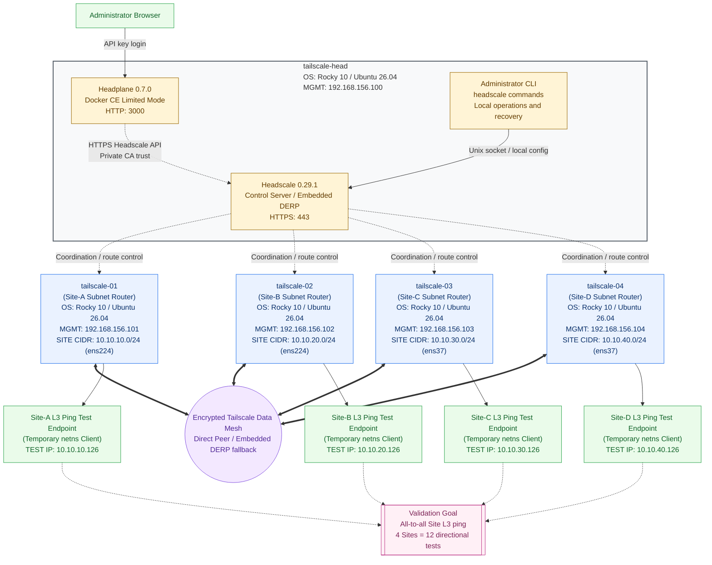
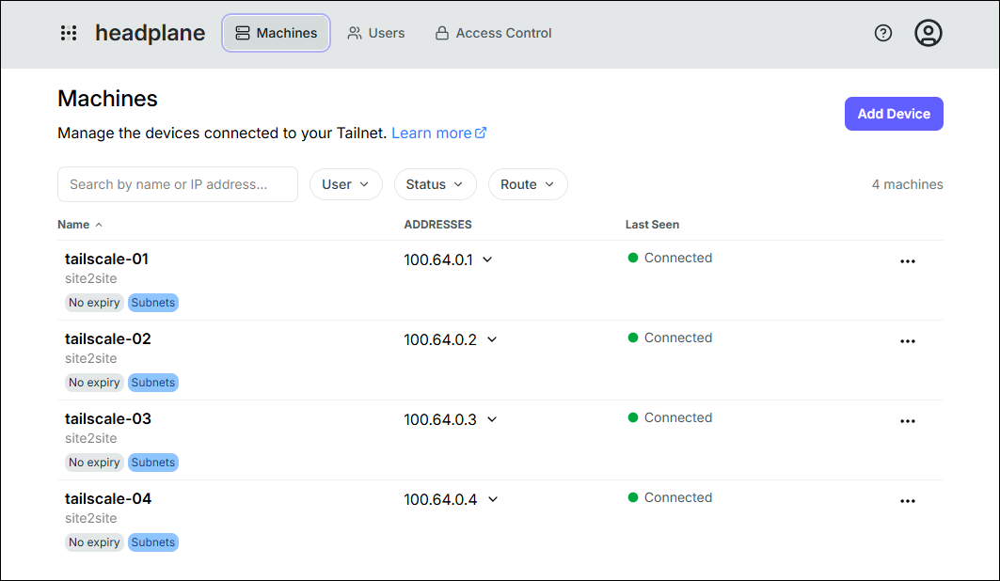

# Headscale + Tailscale Site-to-Site VPN with Ansible

<!-- Keep README.md and README.ko.md structurally and semantically synchronized. -->

An Ansible Role-based IaC project that deploys an internal CA-backed Headscale
control server and Tailscale subnet routers to build an on-premises
Site-to-Site Layer 3 VPN. It automates Embedded DERP, subnet route approval, IP
forwarding, and MSS Clamping. Test endpoints at each Site and NetworkManager NIC
connection profiles are outside its management scope.

## Validated Environment and Requirements

The following environment was used to build and validate the current
configuration.

| Category | Validated environment |
|---|---|
| Ansible control node | Ansible Core 2.17.4 |
| Control node Python | Python 3.12.12 |
| Managed OS | Rocky Linux 10, Ubuntu 26.04 LTS amd64 |
| Headscale | 0.29.1 standalone binary |
| Tailscale | Package from the distribution-specific Tailscale stable repository |

Ansible Core 2.17.4 or later is recommended. Compatibility of the modules,
Jinja filters, and task behavior used by this project is not guaranteed on
older versions.

Full installation on a clean OS, Headscale registration, subnet route
approval, and Site-to-Site connectivity have been validated on both Rocky
Linux 10 and Ubuntu 26.04 LTS amd64. Roles automatically detect the OS through
Ansible Facts and select the appropriate package names, Chrony configuration
and service, CA trust store, and Tailscale repository. There is no need to set
the target OS in vars. Distributions and versions that are not explicitly
supported stop early in the installation.

## Validated Four-Site Topology

The diagram reflects the current `inventory.ini` validation environment.
Dashed lines are Headscale control-plane connections. Thick lines represent the
logical encrypted Tailscale data mesh, which uses direct Peer-to-Peer paths
when available and Embedded DERP as a fallback. Headscale coordinates the
Tailnet but is not a mandatory central data-path gateway.

<!-- Keep this validated topology synchronized with inventory.ini. -->



The control node requires the following commands:

- `ansible-playbook`
- `ssh`

Managed nodes must already have NIC and IP configuration and be reachable over
SSH.

## Project Structure

- `vars-common.yaml`: versions, paths, certificate DN, ports, and behavior shared by all nodes
- `vars-vault.yaml`: Vault file for SSH Bootstrap and optional sudo passwords, excluded from Git
- `vars-OS-RedHat.yaml`, `vars-OS-Debian.yaml`: OS-family-specific packages, services, CA trust, and Tailscale repository variables
- `inventory.ini`: Ansible targets and management IP addresses
- `roles/ssh_bootstrap`: parallel initial SSH key deployment using Vault authentication and built-in modules
- `roles/os_compat`: supported OS/architecture validation and OS-specific variable loading
- `roles/common`: common OS settings, time synchronization, hosts, packages, and optional firewalld
- `roles/headscale`: CA/TLS, Headscale binary/config/policy/systemd/user
- `roles/headplane`: Docker CE and the Headplane admin UI in Limited Mode
- `roles/tailscale_router`: CA trust, Tailscale, forwarding, MSS Clamping, and node registration
- `roles/site_test_endpoint`: optional netns test endpoint creation and inter-Site ping validation
- `pb-tailscale-with-headscale.yaml`: complete execution order and subnet route approval
- `run.sh`: playbook entry point

## Before You Run

The control node must be able to connect to every managed node over SSH and use
`become`. The current inventory defaults to the `root` account. To use a
different account or SSH key, adjust `ansible_user`, `ansible_port`, and any
required connection variables in `inventory.ini`. On environments such as
Ubuntu images that do not allow root SSH login by default, set the actual SSH
account, such as `ansible_user=ubuntu`, on each host line. A host-line value
overrides the default `ansible_user=root` in `[all:vars]`, which explicitly
uses `sudo` to become root. Keeping `ansible_user=root` works normally even
with the privilege-escalation settings present.

Use one of these three sudo authentication methods for a non-root SSH account:

1. Preconfigure the required sudo authorization for the account or its
   `wheel`/`sudo` group. For fully unattended deployment, also configure an
   appropriately scoped `NOPASSWD` policy in advance.
2. When sudo requires a password, enter it once with
   `./run.sh --ask-become-pass`.
3. For unattended execution, store a separate
   `vault_ansible_become_password` in `vars-vault.yaml`, then set
   `ansible_become_password={{ vault_ansible_become_password }}` for the host or
   in `[all:vars]`.

The SSH login password in `vault_ssh_root_password` and the sudo password serve
different purposes, so keep them as separate variables even when their values
happen to match.

If passwordless SSH is not yet configured, set the following values in
`vars-common.yaml`. A `.pub` public key matching the private key name must
exist.

```yaml
ssh_bootstrap_enabled: true
ssh_bootstrap_identity_file: /root/.ssh/id_rsa
ssh_bootstrap_public_key_file: "{{ ssh_bootstrap_identity_file }}.pub"
ssh_bootstrap_connect_timeout: 10
```

When all targets share the same initial SSH password, store the common variable
in encrypted `vars-vault.yaml`. The value below is only a placeholder; never
create a plaintext vars file or commit the real password.

```yaml
vault_ssh_root_password: "common-initial-SSH-password"
# Add only when a non-root SSH account requires a sudo password
vault_ansible_become_password: "sudo-password"
```

When targets use different SSH passwords, use a map keyed by inventory
hostname instead:

```yaml
vault_ssh_passwords:
  tailscale-head: "HEAD-SSH-password"
  tailscale-01: "SITE01-SSH-password"
  tailscale-02: "SITE02-SSH-password"
  tailscale-03: "SITE03-SSH-password"
  tailscale-04: "SITE04-SSH-password"
```

When both the common variable and map are defined, map entries take precedence,
so only exceptional hosts need overrides:

```yaml
vault_ssh_root_password: "common-password-for-most-hosts"
vault_ssh_passwords:
  tailscale-04: "TAILSCALE04-exception-password"
```

Map keys must exactly match hostnames in `inventory.ini`. A key outside the
`tailscale` group is treated as a typo and stops deployment. Each host selects
its password in this order: `vault_ssh_passwords[hostname]`,
`vault_ssh_root_password`. If neither exists, the role names that host and
fails before opening its SSH connection. Interactive password entry is not
supported.

`vars-vault.yaml` is not supplied by the repository and is ignored by Git. It
is required while SSH Bootstrap is enabled, but it may be absent after keys are
deployed and `ssh_bootstrap_enabled: false` is used. The default Vault master
password file is `~/.ansible_vault_pass_tailscale`; restrict both files to mode
`0600`.

```bash
ansible-vault create \
  --vault-password-file ~/.ansible_vault_pass_tailscale \
  vars-vault.yaml
chmod 600 vars-vault.yaml ~/.ansible_vault_pass_tailscale
```

Use the following command for later changes:

```bash
ansible-vault edit \
  --vault-password-file ~/.ansible_vault_pass_tailscale \
  vars-vault.yaml
```

`run.sh` automatically supplies `~/.ansible_vault_pass_tailscale`. To use another path,
set only the password-file path in the environment:

```bash
ANSIBLE_VAULT_PASSWORD_FILE=/secure/path/vault-pass ./run.sh
```

The first Play targets each host in the `tailscale` group directly instead of
looping from localhost. After the initial Vault-authenticated SSH connection,
the built-in `getent`, `file`, and `lineinfile` modules idempotently add the
controller public key to the login account's `authorized_keys`. The default
`forks = 20` in `ansible.cfg` processes up to 20 hosts concurrently; override
it at runtime with a command such as `./run.sh --forks 50`. Failures are
not immediately fatal to the whole run; only the failed host's remaining
Bootstrap stages are skipped. After every host completes Vault validation, SSH
authentication, account lookup, directory creation, and key deployment, a
separate Gate reports all hostnames, management IPs, and failure stages at
once. If any host failed, the Gate stops the entire playbook before common or
later deployment plays begin. The output includes an `SSH Bootstrap summary:`
header, per-host status, the `N of M` failure count and host list, and whether
subsequent deployment plays were withheld.

Failure stages are classified as `vault_validation`, `authentication`,
`account_lookup`, `ssh_directory`, `authorized_keys`, or `missing_result`.
This lets large environments identify and remediate every failing node from a
single run.

After initial key deployment, set `ssh_bootstrap_enabled: false` to run the
complete deployment with the existing SSH key and without Vault. When root
password login is prohibited, use the actual SSH account and host-specific
Vault map.

Do not commit either `vars-vault.yaml` or `~/.ansible_vault_pass_tailscale`.
`run.sh` starts without Vault options when the Vault vars file is absent, but
an enabled SSH Bootstrap play validates the missing password per host and
stops. If the Vault file exists but its master password file is unreadable,
`run.sh` stops immediately. No
`vars-vault.example.yaml` is provided; this document is the source of truth for
the required variable structure. If a plaintext password was committed, rotate
it immediately and remove it from Git history.

Edit `inventory.ini` for the target environment. Use the inventory host name as
the host name and set its management IP with `ansible_host`. Host-specific
values such as `host_alias`, `site_nic`, `site_cidr`, and certificate SANs are
also assigned on the corresponding host line.

```ini
[headscale]
my-head.example.com ansible_host=192.168.156.100 ansible_user=ubuntu host_alias=head cert_dns_sans='["my-head.example.com", "head"]' cert_ip_sans='["192.168.156.100"]'

[tailscale_routers]
site-a.example.com ansible_host=192.168.156.101 ansible_user=root host_alias=site-a site_nic=ens224 site_cidr=10.10.10.0/24
site-b.example.com ansible_host=192.168.156.102 ansible_user=admin host_alias=site-b site_nic=ens224 site_cidr=10.10.20.0/24

[site_test_endpoints]
site-a.example.com site_test_ip=10.10.10.201
site-b.example.com site_test_ip=10.10.20.202

[all:vars]
ansible_python_interpreter=/usr/bin/python3
ansible_user=root
ansible_ssh_private_key_file=~/.ssh/id_rsa
ansible_become=true
ansible_become_user=root
ansible_become_method=sudo
```

`ansible_user=root` in `[all:vars]` is the default SSH account. An
`ansible_user` on a host line overrides it, so only nodes requiring a non-root
account need a different value. `[all:vars]` also applies `/usr/bin/python3`,
the default private key, and sudo-based root privilege escalation to every
managed node. Override the private key on an individual host line when
necessary. `/usr/bin/python3` exists on the supported Rocky Linux 10 and Ubuntu
26.04 targets.

NIC addresses are expected to be configured already; this playbook does not
modify NetworkManager connection profiles. `site_nic` is the Site LAN NIC name
on each router, and `site_cidr` is the LAN prefix advertised by that router.

Firewalld and SELinux settings are not managed by default. Both options apply
only to RedHat-family systems such as Rocky Linux and should be enabled in
`vars-common.yaml` only when the target environment uses them. Enabling them on
Ubuntu stops the installation early to prevent an invalid firewall
configuration. The Ubuntu AppArmor state is not changed.

```yaml
common_manage_firewalld: true
common_manage_selinux: true
```

When `common_manage_firewalld: false`, installation and startup of firewalld,
port changes, and zone changes are all skipped. An existing firewalld service
is not stopped or removed. When `common_manage_selinux: false`, restoration of
SELinux contexts on Headscale files is skipped. The SELinux
enforcing/permissive/disabled state itself is not changed.

MSS Clamping, which prevents tunnel MTU issues for Site-to-Site TCP traffic, is
enabled by default independently of Firewalld.

```yaml
tailscale_manage_mss_clamping: true
tailscale_interface: tailscale0
```

The router maintains one TCP SYN rule for each input and output direction of
`tailscale0` in the mangle/FORWARD chain. The rules remain applied after a
reboot through `tailscale-mss-clamping.service`. Disable it with
`tailscale_manage_mss_clamping: false` only in special environments where an
external firewall manager owns the same rules.

## Site-to-Site Packet Flow

The direct path used when a Site-A client communicates with a Site-B client is
shown below.

```text
Site-A Client 10.10.10.10
Gateway 10.10.10.101
        │ ① Site-A Router receives the packet and
        │    selects tailscale0 for the 10.10.20.0/24 route
        ▼
Site-A Router ens224 → tailscale0
        │ ② tailscaled selects the Site-B Router Peer and
        │    encrypts and UDP-encapsulates the original packet
        ▼
Site-A Router ens160  192.168.156.101
        │ ③ Direct transmission over the Underlay
        │    192.168.156.101 → 192.168.156.102
        ▼
Site-B Router ens160  192.168.156.102
        │ ④ After Peer verification, the packet is decrypted and
        │    injected into tailscale0; Linux selects ens224 for
        │    the 10.10.20.0/24 route
        ▼
Site-B Router tailscale0 → ens224
        │ ⑤ The original packet is forwarded to the Site-B LAN
        ▼
Site-B Client 10.10.20.10
```

With `--snat-subnet-routes=false`, the original source address `10.10.10.10`
is preserved when the packet reaches the Site-B client. Both clients must
therefore use their Site Router as the default gateway or have a static route
to the remote Site CIDR through that router. If direct UDP connectivity between
routers is unavailable, encrypted traffic is relayed through Headscale's
Embedded DERP.

## Running the Playbook

```bash
./run.sh
```

Standard `ansible-playbook` options, such as selecting an SSH key, can be passed
through unchanged.

```bash
./run.sh --private-key ~/.ssh/id_ed25519
./run.sh --limit tailscale-head
./run.sh --check --diff
```

`--check` is useful for previewing changes from standard Ansible modules such
as template and package, but it cannot reproduce the complete behavior of
command-based operations such as Pre-auth key creation, `tailscale up`, and
route approval. When running in check mode without SSH Bootstrap, passing
`ssh_bootstrap_enabled=false` is recommended.

```bash
./run.sh --check --diff -e ssh_bootstrap_enabled=false
```

Use tags to run an individual Role or stage.

```bash
./run.sh --tags ssh_bootstrap
./run.sh --tags common
./run.sh --tags headscale
./run.sh --tags headplane
./run.sh --tags tailscale_router
./run.sh --tags route_approval
./run.sh --tags site_test_endpoint -e tailscale_site_test_enabled=true
```

Headplane starts after the Headscale API is ready and listens on TCP 3000 of
the `tailscale-head` management address. Open
`http://192.168.156.100:3000/admin/` and log in with a Headscale API key. The
API key is not stored in Ansible variables or the Headplane configuration. The
default `database` policy mode seeds `policy.hujson.j2` into SQLite once, then
Headplane or the API owns subsequent policy changes. Set
`headscale_policy_mode: file` to make the Ansible template authoritative again.

To run disabled SSH Bootstrap once without editing the vars file, enable it
with an extra variable. Vault SSH passwords must be available.

```bash
./run.sh --tags ssh_bootstrap -e ssh_bootstrap_enabled=true
```

Combine `--limit` with a tag to restrict the target hosts as well.

```bash
./run.sh --tags tailscale_router --limit tailscale-01 -vv
```

List tags and tasks with the following commands.

```bash
./run.sh --list-tags
./run.sh --tags headscale --list-tasks
```

Do not use `--limit` for the first complete deployment. Headscale
configuration, router registration, and advertised route approval must run in
that order.

## Optional netns Test Endpoint Validation

The Site-to-Site data path can be validated without physical Site clients by
creating a temporary Linux network namespace and veth on each Router. Add only
the Routers to validate to the optional `[site_test_endpoints]` group and set a
host-specific `site_test_ip`.

```ini
[site_test_endpoints]
tailscale-01 site_test_ip=10.10.10.201
tailscale-02 site_test_ip=10.10.20.202
```

If the test is not required or test IPs cannot be allocated, leave the group
empty or remove it. This does not affect installation or operation of the
`[tailscale_routers]` group.

Run the validation after the complete installation and route approval.

```bash
./run.sh --tags site_test_endpoint -e tailscale_site_test_enabled=true
```

The Role creates a netns on each Router and automatically pings every other
Site endpoint. The default is `false`, which does not create the test
environment. To remove it automatically after validation, add the following
option.

```bash
./run.sh --tags site_test_endpoint \
  -e tailscale_site_test_enabled=true \
  -e tailscale_site_test_cleanup_after_validation=true
```

A retained test environment can be inspected and removed manually on each
Router as follows.

```bash
ip netns exec ns-test ping -c 4 <remote-site_test_ip>
ip netns exec ns-test traceroute <remote-site_test_ip>
/usr/local/sbin/tailscale-site-test-endpoint cleanup
```

## Re-running and Changing Variables

The playbook is designed for repeated execution. A Tailscale node that is
already registered does not create a new Pre-auth key; `tailscale up` instead
reconciles it with the desired settings. Headscale creates a one-time key only
for an unregistered node, and Ansible hides the key from its output.

- Config/systemd/TLS deployment change: restart Headscale
- File policy change: deploy the Ansible template and restart Headscale
- Database policy change: Headplane/API writes SQLite; Ansible does not overwrite it
- CA change: reissue the CA and server certificate, update trust stores, and restart related services
- Server SAN/IP change: reissue the server certificate
- Forwarding change: apply `sysctl --system`
- Site CIDR change: reconcile the router advertisement and approve it in Headscale
- Site NIC change: add the new NIC to the firewalld trusted zone
- MSS Clamping change: reapply without duplicates through the systemd oneshot service

Existing NICs are not automatically removed from the trusted zone. A node may
legitimately have multiple trusted NICs, and deleting firewall settings not
owned by Ansible could cause an outage. If the previous NIC must be removed
after replacement, do so explicitly.

```bash
firewall-cmd --permanent --zone=trusted --remove-interface=<OLD_NIC>
firewall-cmd --reload
```

Changing the CA DN issues a new root CA, so the full playbook must be applied to
all registered clients. When `headscale_data_dir` changes, existing databases
and keys are not moved automatically to prevent data loss. To preserve state,
plan and perform migration of the database and noise/DERP keys before running
the playbook.

## Policy Storage Modes and Migration

`headscale_policy_mode` selects the authoritative policy store. The default is
`database` so Headplane can edit Access Control, while the DBMS remains SQLite.

```yaml
headscale_database_type: sqlite
headscale_database_path: "{{ headscale_data_dir }}/db.sqlite"
headscale_policy_mode: database
headscale_policy_path: "{{ headscale_config_dir }}/policy.hujson"
```

| Mode | Authoritative policy | Role of `policy.hujson.j2` |
|---|---|---|
| `file` | `/etc/headscale/policy.hujson` | Always-active source |
| Initial `database` install | Empty SQLite policy | Initial policy seed |
| Running `database` install | `/var/lib/headscale/db.sqlite` | Seed, recovery, and file-mode fallback |

Headscale itself does not automatically read `policy.hujson` in database mode.
This project's role validates and stores the template with `headscale policy
set` only when `headscale policy get` returns `acl policy not found`. Any
stored policy, including `{}` or an empty `grants` policy, is preserved as a
valid operator policy, so later Ansible runs do not overwrite Headplane/API
changes.

To permanently select file mode, change the variable and apply the role:

```yaml
headscale_policy_mode: file
```

```bash
./run.sh --tags headscale
```

### Safely Migrating an Existing File Policy to Database Mode

Preload the file policy into SQLite before changing modes to avoid a transient
default-allow period. Run these commands as root on `tailscale-head`:

```bash
headscale policy check --file /etc/headscale/policy.hujson
cp -a /etc/headscale/policy.hujson /root/policy-before-database.hujson
systemctl stop headscale
install -d -m 0700 /root/headscale-backup-before-policy-database
cp -a /var/lib/headscale/db.sqlite /root/headscale-backup-before-policy-database/
find /var/lib/headscale -maxdepth 1 -type f -name 'db.sqlite-*' \
  -exec cp -a {} /root/headscale-backup-before-policy-database/ \;
runuser -u headscale -- /usr/local/bin/headscale \
  -c /etc/headscale/config.yaml policy set \
  --bypass-server-and-access-database-directly \
  --file /etc/headscale/policy.hujson
```

Then set `headscale_policy_mode: database` on the control node and apply it:

```bash
./run.sh --tags headscale
```

Verify the result:

```bash
grep -A 2 '^policy:' /etc/headscale/config.yaml
headscale policy get > /root/policy-effective-after-database.hujson
headscale policy check --file /root/policy-effective-after-database.hujson
curl -k https://192.168.156.100/health
```

When intentionally creating a new SQLite DB, the next Ansible run detects the
missing policy and seeds it again automatically. Stop and back up Headscale
before deleting production database state.

Use these commands for routine database-policy backup and recovery:

```bash
headscale policy get > /root/policy-backup.hujson
headscale policy check --file /root/policy-backup.hujson
headscale policy set --file /root/policy-backup.hujson
```

If an invalid DB policy prevents API access, add
`--bypass-server-and-access-database-directly` to `policy get/set`. Stop
Headscale and run direct DB operations as the `headscale` user to preserve
SQLite file ownership.

## Headplane Admin UI

Headplane is an optional convenience Web UI, not a Headscale runtime
requirement. Users, nodes, routes, and policy can all be managed with the
Headscale CLI alone. The default `headplane_enabled: true` includes this
convenience feature. After Headscale installation, the Headplane role installs Docker CE on
`tailscale-head` and runs the pinned `ghcr.io/tale/headplane:0.7.0` image in
Limited Mode. It does not change the existing systemd Headscale service or TCP
443 listener, and it does not mount the Docker socket, Headscale DB, or TLS
private keys into the container.

```yaml
headplane_enabled: true
headplane_version: "0.7.0"
headplane_port: 3000
headplane_config_dir: /opt/headplane
headplane_data_volume: headplane-data
```

To skip Headplane installation, set the following in `vars-common.yaml`:

```yaml
headplane_enabled: false
```

`false` only skips the Docker CE and Headplane roles during that Ansible run.
It does not stop or remove an existing container, volume, or configuration.
Existing installations are removed only when an operator deliberately runs
the explicit removal commands below. A one-time override is also available:

```bash
./run.sh -e headplane_enabled=false
```

The role creates the cookie secret once and passes the public Headscale Root CA
through `NODE_EXTRA_CA_CERTS`. It recreates the container only when the
configuration, secret, CA, or image ID deployment hash changes, while retaining
the `headplane-data` volume. The Headscale API key is entered on the login page
and is not stored in Ansible or the configuration file.

```bash
./run.sh --tags headplane
```

This command performs installation only when `headplane_enabled: true`.

Access and verify Headplane:

```text
http://192.168.156.100:3000/admin/
```

After deployment, Headplane provides a Web UI for viewing and managing the
users, nodes, addresses, and connection state registered with the on-premises
Headscale server.



```bash
docker inspect headplane \
  --format 'status={{.State.Status}} health={{.State.Health.Status}} restarts={{.RestartCount}}'
docker logs --tail 100 headplane
```

Healthy logs contain `Connected to Headscale 0.29.1`, and the health status is
`healthy`. Headplane currently serves HTTP, so expose TCP 3000 only to a
trusted management network, never the internet. The role opens 3000/tcp when
`common_manage_firewalld: true`.

Removing the container does not affect Headscale. Remove the volume and
configuration directory only when intentionally discarding Headplane data.

```bash
docker rm -f headplane
docker volume rm headplane-data
rm -rf /opt/headplane
```

## Verification

```bash
ansible tailscale -b -m command -a 'systemctl is-active firewalld'
ansible headscale -b -m command -a 'headscale nodes list-routes'
ansible headscale -b -m command -a 'headscale policy get'
ansible headscale -b -m command -a 'docker inspect headplane'
ansible tailscale_routers -b -m command -a 'tailscale status'
ansible tailscale_routers -b -m command -a 'sysctl net.ipv4.ip_forward'
ansible tailscale_routers -b -m command -a 'systemctl is-active tailscale-mss-clamping'
ansible tailscale_routers -b -m command -a 'iptables -t mangle -S FORWARD'
```

Validate the final data path by running `ping` and `traceroute` from each Site
test client to a remote client, and use `tcpdump` on each subnet router's Site
NIC and `tailscale0`.

## Headscale Administration and Operations Commands

The following examples assume execution as `root` on the Headscale server. The
Headscale CLI itself does not require root; a user with access to the Headscale
Unix socket and related configuration files can also run it. Controlling the
systemd service and reading some logs may require root or sudo privileges.
Check the exact subcommands and options for the installed version with
`headscale <command> --help`.

### Status and Configuration Checks

```bash
headscale version
headscale health
runuser -u headscale -- \
  /usr/local/bin/headscale configtest --config /etc/headscale/config.yaml
systemctl status headscale --no-pager
journalctl -u headscale -n 100 --no-pager
```

- `version`: displays the installed CLI version.
- `health`: checks Headscale API health and may exit with status `0` without output when healthy.
- `configtest`: validates `config.yaml` before a restart while running as the service account. Running it as the service account prevents generated files from changing ownership to `root`.
- `systemctl`, `journalctl`: help diagnose startup failures and Unix socket connection failures.

### Listing Users and Nodes

```bash
headscale users list
headscale nodes list
headscale nodes list --output json
```

- `users list`: displays user names and IDs. A user ID is required when creating a Pre-auth key.
- `nodes list`: displays node IDs, owners, Tailnet IPs, connection state, and expiration state.
- `--output json`: is suitable for scripts and automated processing with `jq`.

```bash
headscale nodes list --output json | jq '.[] | {id, name, user, online}'
```

### Checking and Approving Subnet Routes

```bash
headscale nodes list-routes
headscale nodes approve-routes \
  --identifier <NODE_ID> \
  --routes 10.10.10.0/24
```

In `list-routes`, `Available` is a route advertised by a Router, `Approved` is a
route approved by an administrator, and `Serving` is a route currently being
provided. The complete Play automatically approves each `site_cidr` from the
inventory, so manual approval should be used only for troubleshooting or
emergency operations.

### Checking and Manually Issuing Pre-auth Keys

```bash
headscale preauthkeys list
headscale preauthkeys create --user <USER_ID>
```

By default, a Pre-auth key is single-use and has a limited validity period. Its
output is passed to `tailscale up --authkey` when registering a new node, so it
must be handled as sensitive as a password and must not be recorded in logs,
shell scripts, or the Git repository. Ansible automatically issues a key only
for an unregistered Router and hides it from output.

### Command Help

```bash
headscale --help
headscale users --help
headscale nodes --help
headscale preauthkeys --help
```

Headscale CLI options can change between versions. Check `--help` for the
installed version before running a destructive operation or automation code.

## Tailscale Router Administration and Operations Commands

Run the following commands on each Site's Tailscale Router. Most read-only
commands can be run by a user with access to the `tailscaled` local API, while
service control and Linux routing or firewall inspection may require root or
sudo privileges.

### Checking Version, Connectivity, and Addresses

```bash
tailscale version
tailscale status
tailscale status --json
tailscale ip -4
tailscale ip -6
systemctl status tailscaled --no-pager
```

- `status`: displays the local Tailnet state and each Peer's Tailnet IP, connectivity, and current path.
- `status --json`: is useful for monitoring and automated checks with `jq`.
- `ip`: displays the Tailscale IPv4 or IPv6 address assigned to the current Router.
- `systemctl`: displays the running and failure state of the `tailscaled` process.

```bash
tailscale status --json | jq '{BackendState, Self, Peer}'
```

### Checking Peer Paths and Underlay State

```bash
tailscale ping --c 4 <PEER_NAME_OR_100.X_IP>
tailscale netcheck
journalctl -u tailscaled -n 100 --no-pager
tailscale debug daemon-logs
```

- `tailscale ping`: is more useful than a standard ICMP ping for Tailnet path diagnosis and reports whether the Peer is reached directly or through DERP.
- `netcheck`: displays Underlay UDP availability, NAT characteristics, and DERP latency.
- `journalctl`: displays historical daemon logs.
- `debug daemon-logs`: streams current daemon logs; press `Ctrl+C` to stop.

### Checking Subnet Router Settings and Linux Forwarding Paths

```bash
tailscale debug prefs
ip route show table 52
sysctl net.ipv4.ip_forward
iptables -t mangle -S FORWARD
systemctl status tailscale-mss-clamping --no-pager
```

- `debug prefs`: is useful for checking the current local preferences, including the Headscale URL, advertised routes, route acceptance, and SNAT. Debug subcommands can change between Tailscale versions, so check `tailscale debug --help` first.
- `ip route show table 52`: displays remote Site routes installed by Tailscale on Linux.
- `ip_forward`: displays whether Layer 3 forwarding between Sites is enabled.
- `iptables`, `tailscale-mss-clamping`: display the MSS Clamping rules used for VPN encapsulation and the state of their persistence service.

### Distinguishing Peer Connectivity from Site-to-Site Connectivity

```bash
# Check the Tailnet connection to the Tailscale Router Peer itself
tailscale ping --c 4 tailscale-02

# Check the complete Layer 3 path to a remote Site LAN or endpoint
ping -c 4 10.10.20.126
traceroute 10.10.20.126
```

A successful `tailscale ping` confirms the Tailnet connection between Router
Peers. To validate the actual Site-to-Site VPN, run standard `ping` and
`traceroute` commands against a Router NIC or endpoint IP inside the remote
Site's `site_cidr`.

### Cautions When Changing Settings

```bash
tailscale set --help
tailscale up --help
tailscale logout --help
```

This project manages `tailscale up` settings through Ansible. Manual changes
with `tailscale set` or `tailscale up` can be reverted to the values in the
inventory and `vars-common.yaml` on the next Playbook run. In particular,
`tailscale logout` removes the current registration and requires
reauthentication; do not run it unless recovering from a failure or retiring a
node.
